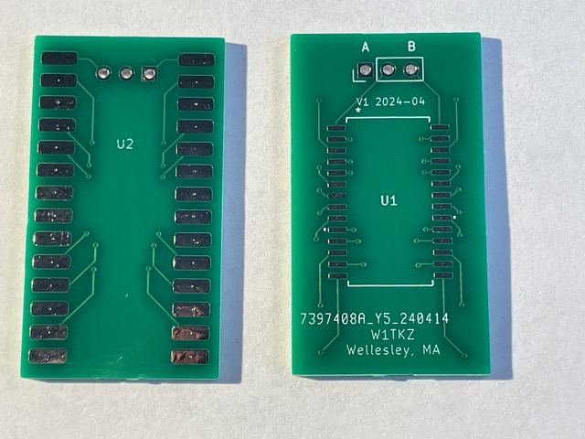
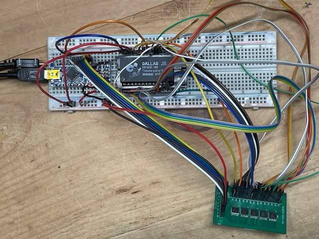
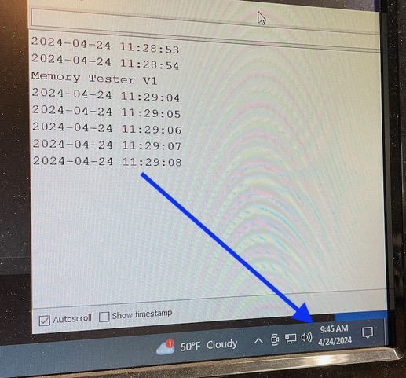
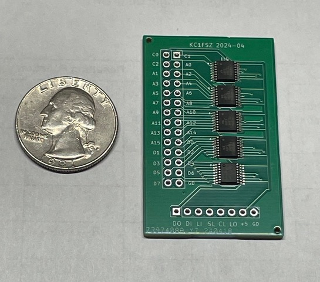
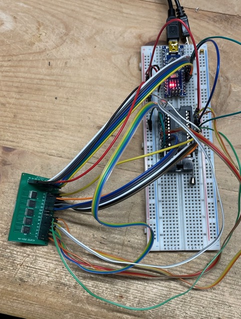
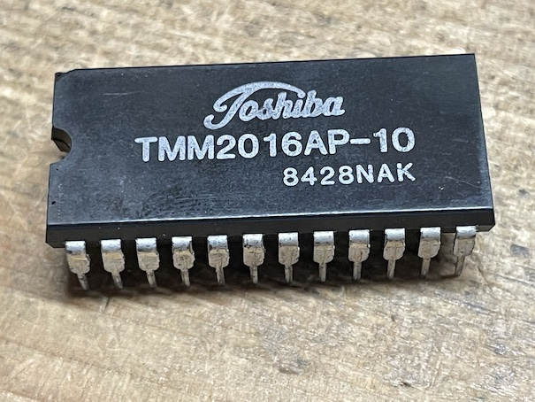

Overview
========
The goal of this project is to produce an adaptor board to allow a "modern" M48T35 NVRAM/RTC chip to be 
used where a
"vintage" DS1643/DS1644 used to be.  This is relevant for owners of S-COM
5K/6K/7K repeater controllers.  The old Dallas Semi parts are
hard to find in DIP format, and at this point their batteries are likely 
dead.

(Testing is still in process - more documentation will follow if this works.)

Here's what the board looks like:

References
==========

* [M48T35 Datasheet](https://www.st.com/content/ccc/resource/technical/document/datasheet/group1/b6/56/b6/36/4d/38/4d/18/CD00000551/files/CD00000551.pdf/jcr:content/translations/en.CD00000551.pdf)
* [DS1643 Datasheet](https://www.analog.com/media/en/technical-documentation/data-sheets/DS1643-DS1643P.pdf) - used in the 5K
* [DS1644 Datasheet](https://www.analog.com/media/cn/technical-documentation/data-sheets/2744.pdf) - used in the 7K

Photograph of DS1643 in an S-COM 5K to demonstrate that mechanical clearance isn't an issue around the chip.

Notes on Testing a DS1643
=========================

I have access to an S-COM 5K that has a DS1643 NVRAM/RTC chip in it. I've been using that 
to do some testing.  I pulled the DS1643 out of the controller and put it into my memory tester (see more detail on that below). It works fine.

This chip is interesting in that the RTC is mapped into the 
very top few bytes of the NVRAM.  On the 8K part you need to read from locations 0x1ff9 to 0x1fff to get the time/date.  IMPORTANT: Remember that all numbers are in 
BCD format with the 1's digit in the low-order nibble and the 10's digit in the high-order nibble of each byte.

When I powered up the chip and read the time from the magic 
locations I was amazed to see that it was correct to within <2 hours after an unknown period
of time of non-use. Obviously, the battery is still good in this 
particular unit. :-)

The S-COM 7K uses a 32K part. Everything should be the same,
except the memory map locations of the RTC are higher.

Notes Related to a Memory Tester
================================

A memory testing device was created to read/write/validate 5V RAM/PROM parts, along with any related adaptor boards. This could be used to test
that a chip/socket is working correctly or to make a copy of an NVRAM/EPROM/EEPROM. 

The tester can support 16 address lines, 8 bit-directional data lines, and three control lines (~OE, ~WE, ~CS, etc),
for a total of 27 signals.  Only 6 GPIO pins on a microcontroller are needed to drive the tester.

The testing cycle writes/reads different patterns into the 
memory chip to make sure there are no bad bits.

Here's what the tester PCB looks like:

Here it is wired into an Arduino Nano and a 28-pin ZIF socket
for testing:

Here's a vintage [Toshiba 2K SRAM chip](http://matthieu.benoit.free.fr/cross/data_sheets/TMM2016AP.pdf) that was tested successfully:

Judging from [this databook](http://www.bitsavers.org/components/toshiba/_dataBook/1983_Toshiba_MOS_Memory.pdf) an the date code
on that chip I'm assuming it's a 1984 part.  We've come a long
way in 40 years!

Tester Shift Register Chain Layout
----------------------------------
       
       |    Control     |   Address Low   |  Address High   |    Data Out     |   Data In      |
       +----------------+-----------------+-----------------+-----------------+----------------+
        C C C x x x x O   A A A A A A A A   A A A A A A A A   O O O O O O O O   I I I I I I I I  
        0 1 2         E   0 0 0 0 0 0 0 0   0 0 1 1 1 1 1 1   0 1 2 3 4 5 6 7   0 1 2 3 4 5 6 7
                          0 1 2 3 4 5 6 7   8 9 0 1 2 3 4 5

                                    =========== DATA FLOW ==========>    

Notes
* Data flows from left to right.
* There is no hand-off between O7 and I0.
* The high-order bit of the Control register (OE) controls the -OE of the Data Out register. So
you must write a zero into this bit when generating a write into a memory device.

Tester Control Interface
------------------------

(From left to right)

* Pin 1: Data Out - High-order bit out of the Data In register (i.e. I7 in the above diagram)
* Pin 2: Data In - Low-order bit into the Control register (i.e. C0 in the above diagram)
* Pin 3: Latch In (+) - Only relevant for the Data In register.  Rising edge locks the memory device output 
into the Data In register.  Make sure that shift/load is set to 1 before doing this.
* Pin 4: Shift/Load - Only relevant for the Data In register.  Issue a zero pulse after the Latch In clock
to move data into the shift register, preparing to shift out the data that was read.
* Pin 5: Clock (+) - Rising edge shifts one position to the right.  Make sure that shift/load is set to 0 before
doing this.
* Pin 6: Latch Out (+) - Rising edge makes the contents of the Control, Address Low, Address High, and Data Out
registers visible to the memory device.  
* Pin 7: 5V
* Pin 8: Ground

Copyright
=========

Copyright (C) 2024 - Bruce MacKinnon

This work is covered under the terms of the GNU Public License (V3). Please consult the LICENSE file for more information.

This work is being made available for non-commercial use. Redistribution, commercial use or sale of any part is prohibited.
