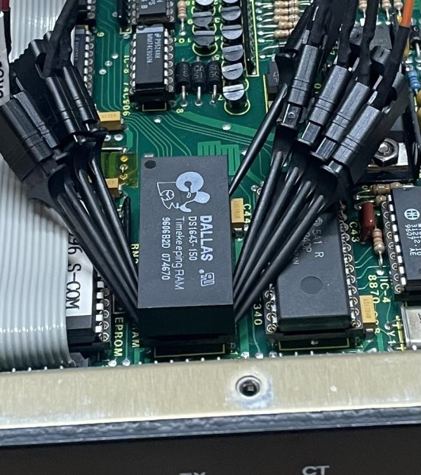

Overview
========
An adaptor board to allow a "modern" M48T35 NVRAM/RTC chip to be used where a
"vintage" DS1643/DS1644 used to be.  This is relevant for owners of S-COM
5K/6K/7K repeater controllers.

(More documentation will follow if this works.)

References
==========

* [M48T35 Datasheet](https://www.st.com/content/ccc/resource/technical/document/datasheet/group1/b6/56/b6/36/4d/38/4d/18/CD00000551/files/CD00000551.pdf/jcr:content/translations/en.CD00000551.pdf)
* [DS1643 Datasheet](https://www.analog.com/media/en/technical-documentation/data-sheets/DS1643-DS1643P.pdf) - used in the 5K
* [DS1644 Datasheet](https://www.analog.com/media/cn/technical-documentation/data-sheets/2744.pdf) - used in the 7K

Photograph of DS1643 in an S-COM 5K to demonstrate that mechanical clearance isn't an issue around the chip.

